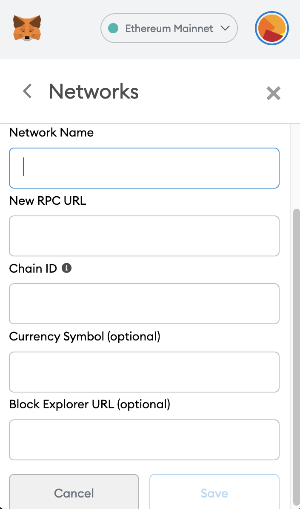

# The Web3 Full Stack NFT Marketplace Digital Store

 This Project Is A Full Stack NFT Marketplace Store Utilizing Solidity, Polygon, IPFS, Next.js, Ethers.js, And HardHat

This Project will be Metaverse Marketplace - Called "The FullStack NFT Marketplace"

Polygon, an Ethereum Scaling Solution enables Developers to build applications on Ethereum with added benefits, as well as a list of other features.


# Before We Get Started

Confirm You Have The MetaMask Browser Extension Installed Along With An Ethereum TestNet Account.


## Installing A Metamask Wallet

If you don't already have it Installed, start by Downloading & Installing the MetaMask Extension for Chrome, Firefox, Brave, or Edge:
  <https://metamask.io/download.html>
(Be Careful To Triple Check The URL And Ensure You Are Downloading From A Trusted Website).

# If You Haven't Set Up MetaMask Before Follow The Instructions To Set Up An Ethereum Account

  <https://metamask.io/download.html>

# Prerequisites

You Will Need To Have The Following:
    1. Node.js Installed On Your Operating System;
    2. Metamask Wallet Extension Installed as a Browser Extension;

# Tech Stack Includes

    -  Ethereum Layer - Polygon;
    -  Web application framework - Next.js;
    -  Solidity Development Environment - Hardhat;
    -  File Storage - IPFS;
    -  Ethereum Web Client Library - Ethers.js;

# About The Project

"Polygon is a Protocol and Framework for Building and Connecting Scalable Solutions on Ethereum by supporting a Multi-Chain Ethereum Ecosystem."

Polygon - at the time of this Project is about 10x Faster than Ethereum, as well as about 10x Cheaper.

This enables Developers the ability to Build and Connect Blockchain Applications on Ethereum Faster, and Cheaper for the End User.
This allows a Developer to provide a much more powerful User Experience as well as open doors for other types of applications on the Ethereum Ecosystem.

The Tools and Techniques laydown the foundation for the Applications on this stack such as:
     Dealing with Payments, Commissions, and Transfers of Ownership on the Contract Level as well as how the Client-Side Application would utilize the Smart Contract.


# A User Puts An Item Up For Sale

    The Ownership of the item is transferred from the Creator to the Marketplace.
    When a User purchases an Item, the purchase price is transferred from the Buyer to the Seller, and the item is transferred from the Marketplace to the Buyer.

# The Marketplace Owner Set's A "Listing Fee"

    This "Fee" is taken from the Seller and transferred to the Contract Owner upon completion of the sale enabling the Owner of the Marketplace to earn "Recurring Revenue" from any sale transacted within the Marketplace.

# The Marketplace Consists Of Two Smart Contracts

    1. #NFT Contract:
        - This Contract allows the Users to Mint Unique Digital Assets.

    2. #Marketplace Contract: 
        - This Contract allows the Creator to put the Digital Assets up For Sale on the Open Marketplace.

# Change the file named example.secret to secret in the project

    At this time we'll just leave this file empty. 
    Later we'll populate it with a test wallet private key that will hold some Matic tokens that we'll get from the Matic testnet faucet.

# Change the file named example.env to .env in the project

    To be safe, we'll be storing these values in the environment variable file when working with wallets that contain tokens.
    To omit from Git, add .secret to your .gitignore file.

# Change the file named example.infuraid to .infuraid in the project


# To Run Project

# Gitpod

## Deploy Project To Gitpod Follow These steps

1. Click this link to deploy

[](https://gitpod.io/#github.com/TheDevloperFarm/web3-teachers-training-store.git)

1. In __pages/index.js__, pass in the RPC address given to you by GitPod to the call to `JsonRpcProvider` function:

```javascript
/* Update This: */
const provider = new ethers.providers.JsonRpcProvider()

/* To This: */
const provider = new ethers.providers.JsonRpcProvider("https://8545-youendpoint.gitpod.io/")
```

3. Import the RPC address given to you by GitPod into your MetaMask wallet



# Local Setup

# To Run This Project Locally Follow These Steps

1. Clone the project locally, change into the directory, and install the dependencies:

```sh
git clone https://github.com/TheDevloperFarm/web3-teachers-training-store.git

cd web3-teachers-training-store.git

# Install NPM Or Yarn
npm install

# or

yarn
```

2. Start the local Hardhat node

```sh
npx hardhat node
```

3. With the network running, deploy the contracts to the local network in a separate terminal window

```sh
npx hardhat run scripts/deploy.js --network localhost
```

4. Start the app

```
npm run dev
```

# Configuration

    To deploy to Polygon test or main networks, update the configurations located in __hardhat.config.js__ to use a private key and, optionally, deploy to a private RPC like Infura.

```javascript
require("@nomiclabs/hardhat-waffle");
const fs = require('fs');
const privateKey = fs.readFileSync(".secret").toString().trim() || "01234567890123456789";

// infuraId Is Optional If You Are Using Infura RPC
const infuraId = fs.readFileSync(".infuraid").toString().trim() || "";

module.exports = {
  defaultNetwork: "hardhat",
  networks: {
    hardhat: {
      chainId: 1337
    },
    mumbai: {
      // Infura
      // url: `https://polygon-mumbai.infura.io/v3/${infuraId}`
      url: "https://rpc-mumbai.matic.today",
      accounts: [privateKey]
    },
    matic: {
      // Infura
      // url: `https://polygon-mainnet.infura.io/v3/${infuraId}`,
      url: "https://rpc-mainnet.maticvigil.com",
      accounts: [privateKey]
    }
  },
  solidity: {
    version: "0.8.4",
    settings: {
      optimizer: {
        enabled: true,
        runs: 200
      }
    }
  }
};
```

# If using Infura

Update __.infuraid__ with your [Infura](https://infura.io/) project ID.
